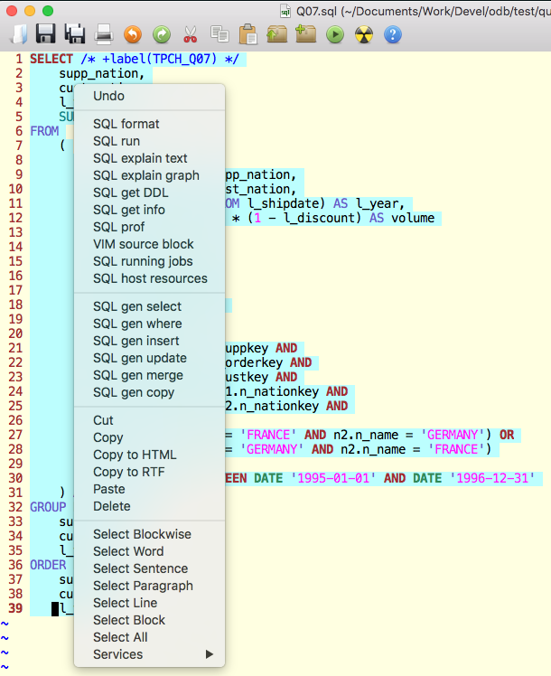

# Vim for Vertica (V4V)
When the [best editor](www.vim.org) meets the [best database](www.vertica.com)...

## Update May 2020

A lot of new functionalities have been added like:

- the possibility to get DDL and other info on tables
- the possibility to generate SQL starting from a table names thank to the scripts contributed by my colleague and friend Marco Gessner
- the possibility to get information about currently running SQL statements and other host information
- lot of small issues have been fixed and scripts are now easier to read and maintain 

## What is V4V 
V4V stands for *Vim for Vertica*. It's a set of VIM plugins and syntax files in order to: 
- Highlight SQL Vertica "the right way" 
- Format SQL commands 
- Run vsql from within VIM getting the results back in VIM 
- Copy SQL snippets in HTML format into your clipboard 

## What V4V consists of 
V4V consists of: 
- VIM Syntax file: ```sqlvertica.vim```
- VIM File Type plugin: ```sql.vim```
- Several add-on scripts: ```vfv_<something>```
- settings to be added to your VIM initialization file: ```.vimrc``` 

## Which tools are used by V4V 
V4V uses: 
- ```vsql``` to run you SQL commands. By default vsql is executed with the following options: 
  o ```-X``` to exclude local vsqlrc 
  o ```-i``` to add execution elapsed 
  o ```vsql``` uses standard ```VSQL_USER``, ```VSQL_PASSWORD```, ```VSQL_HOST```, etc settings. 
- A SQL formatter called ```sqlformat``` (see in the following section how to install it) 
-  ```xclip```(Linux)/```pbcopy```(Mac) tool to copy formatted SQL to your clipboard 
- ```sed``` to manipulate the SQL Interpreter (```vsql``` by default) output
- GraphViz's ```dot``` to transform the Vertica EXPLAIN plan into a graph
- ```xdg-open``` (Linux) or ```open``` to run the PDF visualizer installed on your system

You are free to use a different SQL clients and/or SQL formatters by changing the ``sql.vim`` file type plugin. 

## How to Install V4V 
### V4V Prerequisites
V4V uses an external SQL formatter. You can use any SQL formatter you like as long as you change the default ```sqlformat``` call in the V4V's sql.vim plugin file.
The default formatter (```sqlformat```) can be installed on Linux/Mac as follows:
- Download```python-sqlparse``` from https://github.com/andialbrecht/sqlparse 
- Install the python setup tools: ```sudo apt install python-setuptools```  
- Unzip sqlparse archihve: ```unzip sqlparse-master.zip``` 
- Install sqlparse: ```cd sqlparse-master && sudo python setup.py install``` 

This will create the /usr/local/bin/sqlformat executable which is then used by V4V. This tool has several options; check them with ```sqlfmt --help```. The ones used by default in V4V are:
``` 
    sqlformat -k upper 
              -s 
              -r 
             --indent_width 4 
             --indent_columns.
```
You can change default sqlformat behaviour to better suit your needs by modifying V4V's ```sql.vim``` plugin. 

V4V also uses ```xclip```(Linux) or ```pbcopy``` (Mac) to copy formatted and syntax highlighted SQL into your clipboard. To installl ```xclip``` under Ubuntu/Debian: ```sudo apt install xclip```.
Mac version doesn't need any installation because ```pbcopy``` is available by default.

And, finally, to produce the graphical EXPLAIN plan, V4V uses GraphViz.More specifically the program ```dot```. The installation of this product depends on your operating system... it could be ```sudo apt install graphviz``` under Linux Ubuntu, ```sudo yum install graphviz``` under Linux CentOS or ```brew install graphviz``` on your Mac.

## V4V Installation in 5 easy steps

 - Step 1: Create a backup copy of your ```.vimrc``` before modifying it. 
 - Step 2:   *merge*  ```sample.vimrc``` with your pre-existing copy. The important settings are: 
```vim
let g:sql_type_default = 'sqlvertica'
nnoremap <Tab> za " Toggle to expand/close folds 
menu 20.351 Edit.Copy\ to\ HTML :'<,'>Copy2HTML<CR> 
vnoremenu 1.31 PopUp.Copy\ to\ HTML :'<,'>Copy2HTML<CR> 
```
And the ```CopyToHTML``` function to copy formatted SQL:
```vim
function! CopyToHTML(line1, line2)
"Copy_to_HTML
function! CopyToHTML(line1, line2)
    let g:html_number_lines=0
    let g:html_ignore_folding=1
    let g:html_dynamic_folds=0
    let g:html_use_css=0
    let g:html_font="Courier"
    exec a:line1.','.a:line2.'TOhtml'
    %g/<body/normal k$dgg
    %s/<body\s*\(bgcolor="[^"]*"\)\s*text=\("[^"]*"\).*$/<table \1 width="95%" cellPadding=0><tr><td><font color=\2>/
    %s#</body>\(.\|\n\)*</html>#\='</font></td></tr></table>'#i
    w !pbcopy " Mac: pbcopy, Linux: xclip -selection clipboard
    q!  
endfunction
command! -range=% Copy2HTML :silent call CopyToHTML(<line1>,<line2>)
```

- Step 3: copy V4V's syntax file ```sqlvertica.vim``` under your local syntax directory (for example ```~/.vim/syntax/```) 
- Step 4: copy V4V's File Type plugin ```sql.vim``` under your local *after-directory*. You can check the location in VIM with ```:echo &rtp```. It could be something like ```~/.vim/after/ftplugin``` (Linux) or ```~.vim/ftplugin``` (Mac). 
- Step 5: create a directory ```~/.vim/vertica``` and copy under this directory the following files:
  - ```vfv_info.sh``` (executable)
  - ```vfv_prof.sh``` (executable)
  - ```vfv_copy.sql``` 
  - ```vfv_insert.sql``` 
  - ```vfv_select.sql``` 
  - ```vfv_where.sql``` 
  - ```vfv_update.sql``` 
  - ```vfv_merge.sql``` 
  - ```vfv_jobs.sql``` 
  - ```vfv_host.sql``` 
  - ```vfv_help.txt``` 
## How to use V4V 
Start vim (or its GUI version gvim) and open your SQL file 

- To FORMAT your SQL: 
	- Select the lines containing the SQL to be formatted 
   - Hit F3 or (gvim): right click and select ```SQL Format``` 
- To RUN your SQL: 
   - Select the lines containing the SQL you want to run 
   - Hit F4 or (gvim): right click and select ```SQL run```    
- To EXPLAIN your SQL: 
   - Select the lines containing the SQL you want to EXPLAIN 
   - Hit F5 or (gvim): right click and select ```SQL explain text``` 
- To get the graphical EXPLAIN of your SQL: 
   - Select the lines containing the SQL you want to EXPLAIN 
   - Hit F6 or (gvim): right click and select ```SQL explain graph``` 
 - To print current VSQL environment:  
   - Hit F7  
- To profile your SQL: 
   - Select the lines containing the SQL you want to PROFILE 
   - Hit F8 or (gvim): right click and select ```SQL prof``` 
   - a new tab with the profile information will be created
- To VIM-source a block (containing for example ```let $VSQL_USER='xxx'```: 
   - put your cursor in the block of text (separated by blank lines) containing the VIM instructions you want to source
   - Hit F9 or (gvim): right click and select ```VIM source block``` 
- To list currently running SQL statements: 
   - Hit F10 or (gvim): right click and select ```SQL running jobs``` 
- To list host resources: 
   - Hit F12 or (gvim): right click and select ```SQL host resources``` 
- To get table and associated projection definition (in a new tab): 
   - put your cursor on the table name
   - Hit ```,D``` or (gvim): right click and select ```SQL get DDL``` 
- To get table information like rows distribution and encoding related information(in a new tab): 
   - put your cursor on the table name
   - Hit ```,I``` or (gvim): right click and select ```SQL get info``` 
- To generate a COPY statement for a specific table: 
   - put your cursor on the table name
   - Hit ```,c``` or (gvim): right click and select ```SQL gen copy``` to get the COPY statement in a new tab
   - Hit ```,.c``` to get the COPY statement _inline_ in the same tab
- To generate a SELECT statement for a specific table: 
   - put your cursor on the table name
   - Hit ```,s``` or (gvim): right click and select ```SQL gen select``` to get the SELECT statement in a new tab
   - Hit ```,.s``` to get the SELECT statement _inline_ in the same tab
- To generate an INSERT statement for a specific table: 
   - put your cursor on the table name
   - Hit ```,i``` or (gvim): right click and select ```SQL gen insert``` to get the INSERT statement in a new tab
   - Hit ```,.i``` to get the INSERT statement _inline_ in the same tab
- To generate a MERGE statement for a specific table: 
   - put your cursor on the table name
   - Hit ```,m``` or (gvim): right click and select ```SQL gen merge``` to get the MERGE statement in a new tab
   - Hit ```,.m``` to get the MERGE  statement _inline_ in the same tab
- To generate an UPDATE statement for a specific table: 
   - put your cursor on the table name
   - Hit ```,u``` or (gvim): right click and select ```SQL gen update``` to get the UPDATE statement in a new tab
   - Hit ```,.u``` to get the UPDATE statement _inline_ in the same tab
- To generate a WHERE clause for a specific table: 
   - put your cursor on the table name
   - Hit ```,w``` or (gvim): right click and select ```SQL gen where``` to get the WHERE clause in a new tab
   - Hit ```,.w``` to get the WHERE clause _inline_ in the same tab
- To get help on the Function Keys and other command lines keys:  
   - Hit ```,h``` 
- To EXPAND/CLOSE the result set:  
   - Hit TAB 
- To COPY your SQL snippet to HTML: 
   - Select the lines you want to copy 
   - Run :```'<,'>Copy2HTML<CR>``` or (gvim): right click and select ```Copy to HTML``` 

With a graphical version of Vim, right-clicking on a selected query should present a menu like this:
 

## How to customize V4V
As we said Vim for Vertica uses - by default - ```vsql``` to interact with Vertica. Sometimes you might want to change the standard environment variables used by ```vsql``` in V4V to use a different database, or a different host or user.  
 - to check all environment variables used by VSQL: ```:!set | grep VSQL_```
- to check  individual variables use, for example: ```:echo $VSQL_USER```

To set or change a VSQL environment variable:
 - ```:let $VSQL_DATABASE="<my db name>"```
 - ```:let $VSQL_HOST="<my Vertica host>"```
 - ```:let $VSQL_PASSWORD="<my secret password>"```
 - ```:let $VSQL_PORT="5433"```
 - ```:let $VSQL_USER="<my user>"```


